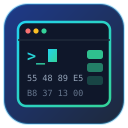

<div align="center">

# ️ idalib-cli

**Agent-native CLI for the IDA Pro IDALib** — every command takes one `-d/--db` flag, every answer is JSON.

**[English](README.md)** · **[中文](README.zh-CN.md)**

   

</div>

---

## ✨ Features

- 🗄️ **Stateless** — pass `-d/--db <PATH>` (a binary or an `.i64`); no daemon, no session bookkeeping.
- 💾 **Persistent IDB state** — the IDB file *is* the state: comments, bookmarks, names and analysis survive across processes.
- 🧩 **Full IDALib coverage** — segments, functions, CFG, disassembly, Hex-Rays decompilation, strings, names, xrefs, entries, metadata, comments, bookmarks, FLIRT signatures.
- ⚡ **batch & parallel** — run many commands with one IDB open; fan a command out to many databases concurrently (glob supported).
- 🤖 **Agent-first** — one JSON document on stdout, errors on stderr; skills included for Codex / Claude Code / OpenCode.

## 🚀 Install

> **Prerequisites**: IDA Pro 9.1 (licensed, launched once) · IDA 9.1 SDK unpacked (build time only) · Rust + LLVM/Clang ([bindgen requirements](https://rust-lang.github.io/rust-bindgen/requirements.html))

```bash
export IDADIR="/Applications/IDA Professional 9.1.app/Contents/MacOS"  # IDA install dir
export IDASDKDIR=$HOME/idasdk91                                        # unpacked SDK (absolute path!)

git clone <this-repo> && cd idalib-cli
cargo install --path .

idalib-cli info    # ✅ verify tool version, IDA version, license
```

> The SDK is needed **at build time only**; the binary links your local IDA libraries at runtime. Dev checks without an SDK: `cargo test --no-default-features --features stub-idalib`.

## 🎮 Commands & usage

Every command needs `-d/--db <PATH>` — an IDB file (`.i64`) or a binary (an
IDB is created next to it on first use). Addresses accept `0x401000` or
`401000`. Output is always one JSON document; errors go to stderr with a
non-zero exit code.

### Database

| Command | Description |
|---|---|
| `idalib-cli -d <bin> db info` | Paths, IDB state, size |
| `idalib-cli -d <bin-or-i64> db info` | Resolved paths, IDB state, size |

### Query

| Command | Description |
|---|---|
| `idalib-cli -d <db> meta` | Filetype, compiler, bitness |
| `idalib-cli -d <db> processor` | Processor info |
| `idalib-cli -d <db> segments` | All segments |
| `idalib-cli -d <db> segments-by-range -a <ea>` | Segment containing an address |
| `idalib-cli -d <db> functions [-u]` | Function list (`-u` = skip lib/thunk) |
| `idalib-cli -d <db> function -a <ea>` | One function: CFG, blocks, xrefs |
| `idalib-cli -d <db> disasm -a <ea> [-n N]` | Disassemble N instructions (default 8) |
| `idalib-cli -d <db> decompile -a <ea> [--all-blocks]` | Hex-Rays pseudo-code |
| `idalib-cli -d <db> insn -a <ea>` | Single instruction |
| `idalib-cli -d <db> strings` | String list |
| `idalib-cli -d <db> names` | Named locations |
| `idalib-cli -d <db> xrefs [-a <ea>] [--all]` | Xrefs to an address, or all |
| `idalib-cli -d <db> entries` | Entry points |

### Edit (persisted in the IDB)

| Command | Description |
|---|---|
| `idalib-cli -d <db> comments get\|set\|append\|remove -a <ea> [-c "text"]` | Comments |
| `idalib-cli -d <db> bookmarks list\|add\|get\|remove -a <ea> [-d "desc"]` | Bookmarks |
| `idalib-cli -d <db> signatures --make [--only-pat]` | Generate FLIRT signatures |

### Combine

| Command | Description |
|---|---|
| `idalib-cli -d <db> batch -- <op> [<op>...]` | Sequential ops, IDB opened once |
| `idalib-cli parallel -d <list\|glob> [--jobs N] -- <op>` | One op across many DBs, subprocess each |
| `idalib-cli info [--version\|--ida\|--all]` | Tool / IDA version, license |

### Scenario walkthroughs

**🔎 Triage an unknown binary**

```bash
idalib-cli -d ./sample meta            # what is it? (filetype/compiler/bitness)
idalib-cli -d ./sample segments        # memory layout
idalib-cli -d ./sample strings         # quick hints
idalib-cli -d ./sample functions -u    # user code only
```

**🔍 Dig into a function**

```bash
idalib-cli -d ./sample function -a 0x401000       # CFG + blocks + xrefs
idalib-cli -d ./sample decompile -a 0x401000      # read the pseudo-code
idalib-cli -d ./sample disasm -a 0x401000 -n 20   # or the raw instructions
idalib-cli -d ./sample xrefs -a 0x401000 --all    # who calls it
```

**📝 Annotate findings (survives across processes/agents)**

```bash
idalib-cli -d ./sample comments set -a 0x401000 -c "parses config, see 0x402100"
idalib-cli -d ./sample bookmarks add -a 0x401000 -d "entry point"
idalib-cli -d ./sample comments get -a 0x401000    # verify
```

**⚡ Bulk analysis of many samples**

```bash
# first pass: create IDBs + overview for every sample
idalib-cli parallel -d "./samples/*.bin" -- "batch -- meta functions -u"

# deep pass: decompile one hot function in every IDB
idalib-cli parallel -d "./samples/*.i64" --jobs 8 -- "decompile -a 0x401000"
```

**🤖 Agent-friendly batched inspection (one JSON doc)**

```bash
idalib-cli -d ./sample batch -- "meta" "segments" "functions -u" "decompile -a 0x401000"
```

Agent workflow guide: [`skills/idalib-cli/SKILL.md`](skills/idalib-cli/SKILL.md); a runnable
end-to-end example in [`examples/workflow.sh`](examples/workflow.sh).

<details>
<summary>Sample output (<code>decompile</code>)</summary>

```json
{
  "id": 7,
  "start": "0x401000",
  "end": "0x401080",
  "size": 128,
  "name": "main",
  "blocks": 3,
  "decompiled": true,
  "pseudocode": "int __cdecl main(...) { ... }"
}
```

</details>

## ⚙️ Configuration

Optional `~/.idapro/idalib-cli/config.toml` (base dir: `$IDALIB_CLI_HOME`):

| Field | Description |
|---|---|
| **idadir** | IDA install dir (default: auto-detected) |
| **idb_dir** | Where new IDBs are created (default: next to the binary) |
| **default_db** | Used when `-d` is omitted |
| **save** | Save the IDB after each command (default `true`) |
| **auto_analyse** | Run full auto-analysis when creating an IDB (default `true`) |

## ❓ FAQ

<details>
<summary>Where does the IDB go when I pass a binary?</summary>

Next to the binary: `./target.bin` → `./target.bin.i64`. Set `idb_dir` in the
config to change the location.

</details>

<details>
<summary>What do batch / parallel actually do?</summary>

`batch` opens the IDB once and runs every op against that handle (saves once
at the end) — best when you need several facts about one database. `parallel`
spawns one subprocess per database (IDALib is not thread-safe, so isolation is
by process) with a worker pool capped by `--jobs` — best for many samples.
`-d` accepts a single path, a comma-separated list, or a glob (`*.i64`).

</details>

<details>
<summary>Can two processes use the same IDB at once?</summary>

Don't. One process per IDB at a time. `parallel` respects this by spawning one
subprocess per database; for manual multi-agent work, give each agent its own
`-d` target.

</details>

<details>
<summary>Why does building require the IDA SDK?</summary>

`idalib-rs` generates its FFI bindings at compile time by parsing the SDK
headers (bindgen). The SDK ships only with your Hex-Rays license and is never
redistributed or embedded — the built binary links your own IDA installation
at runtime.

</details>

## 📁 Project structure

```
idalib-cli/
├── src/
│   ├── cli.rs            # clap definitions; every command + -d/--db
│   ├── ops/              # metadata, comments, bookmarks, db, batch, parallel, ...
│   ├── session/          # config.toml handling
│   └── helpers/          # JSON output views
├── stubs/idalib/         # dev-only API stub (SDK-free checks, never shipped)
├── tests/                # integration tests
├── skills/idalib-cli/   # single agent skill (workflow guide)
└── examples/workflow.sh  # runnable end-to-end example
```

## 🌿 Versions & branches

Tool versions are `x.y.z`; one dev + one release branch per minor:

| Ref | Purpose | Example |
|---|---|---|
| `main` | latest development (merge target of `v*_dev`) | — |
| `v0.9_dev` | development branch for tool 0.9.x | current work |
| `v0.9_release` | stable branch for tool 0.9.x (fixes only) | backports |
| `v0.9.1` (tag) | release point | current release |

| Tool version | Compatible IDA | idalib-rs |
|---|---|---|
| **0.9.x** | 9.1 | 0.6.1 (pinned `=0.6.1`) |
| next (`v0.10_*`) | new IDA version | bumped dependency |

Supporting a new IDA version = bump the `idalib` dependency, update
`[package.metadata.ida]` in `Cargo.toml`, open a new branch line (`v0.10_*`).

## 📄 License

Distributed under the [Apache License 2.0](LICENSE). The `license` field in
`Cargo.toml` declares `MIT OR Apache-2.0` for compatibility with
[idalib-rs](https://github.com/idalib-rs/idalib) dependencies; this repository
ships the Apache-2.0 text only. **Never commit or redistribute the IDA SDK.**

---

**[English](README.md)** · **[中文](README.zh-CN.md)**
